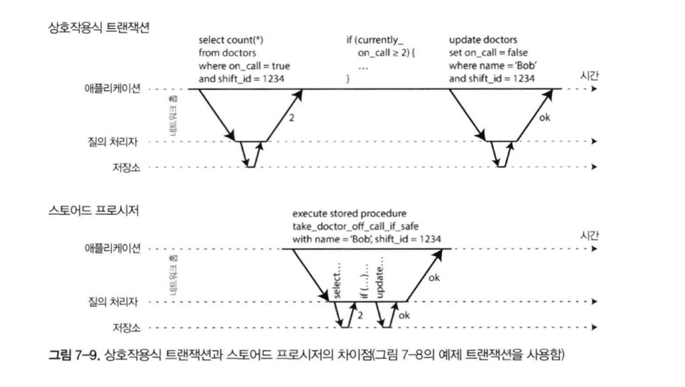

# About acid transaction

트랜잭션에 대해서 알아보자

---
layout: fact
---

어떤 저자들은 2단계 커밋에서 유발되는 성능이나 가용성 문제 때문에 생기는 비용이 너무 커서 이를 지원할 수 없다고 주장했다. 
우리는 항상 트랜잭션 없이 코딩하는 것보다 **트랜잭션을 과용해서 병목지점이 생기는 성능 문제를 애플리케이션 프로그래머가 처리하게 하는 게 낫다**고 생각한다.

_제임스 코벳 외, 스패너: 구글의 전역 분산 데이터베이스(2012)_

---

# 목차

아래 순서로 발표가 진행돼요.

- 📝 내용을 요약합니다.
- 🧑‍💻 우리 도메인엔 어떤 부분들을 고려해 봐야할까요?
- 🤹 질답

---

# Transaction은 무엇인가?

- 애플리케이션의 몇 개의 읽기와 쓰기를 하나의 논리적 단위 묶음
- 데이터베이스에 접속하는 애플리케이션의 프로그래밍 모델을 단순화하기 위해서
- 데이터 시스템의 여러가지 문제(네트워크 장애, 비정상적인 데이터 읽음, 경쟁조건)들을 대신 도맡아주는 것.
  - -> Safety guaratee라고 부름

---

# 근데 사실 트랜잭션의 개념은 모호하다?

- NoSQL Db들이 관계형 데이터베이스 이상의 기능을 지원하면서 트랜잭션에 대한 지원을 포기하거나 재정의함
- 높은 성능과 고가용성을 유지하려면 트랜잭션을 포기해야 한다는 믿음이 널리퍼짐 → CAP이론(?)

---

# ACID의 의미

- ACID compliant는 마케팅 용어다.
- ACID를 따르지 않은 서비스를 BASE(Basically available + Soft state + Evetually consistent)라고 부름

---

# ATOMIC

쪼갤 수 없는 무엇

- 멀티 스레드 프로그래밍에서 한 스레드가 원자적 연산을 한다면, 다른 스레드에서 절반만 완료된 연산을 관찰 할 수 없음.
- ACID의 A는 동시성(멀티 스레딩)과 관련이 없다 - Isolation에서 이를 다루기 때문, 다만 단일 작업에 대한 성공과 실패에 대한 정의만 하고 있다.
- ACID의 원자성은 도중 실패에 대한 **부분적 변경 효과에 대한 문제를 쉽게 만들어줌**. → Abortability가 더 나은 단어일수도?

---

# Consistency

데이터에 관련한 어떤 "불변식"이 존재한다는 것

- 사실 불변식의 보장은 데이터베이스 상에서 할 수 있는 것은 아님
- 데이터베이스가 할 수 있는 일관성 : 외래키 제약조건, 유일성 제약조건
- 그래서 일관성은 실제로 데이터베이스에 속한 개념은 아님

  

### 그외로도 다른 의미

- 5장의 복제 일관성과 최종 일관성의 의미
- 일관성 해싱 : 재균형화를 위해 사용되는 파티셔닝 방법
- CAP : 여기서 일관성은 선형성
- ACID : 데이터베이스가 좋은 상태여야 한다는 것

---

# Isolation

동시에 실행되는 트랜잭션은 서로 격리된다는 것 - 솔직히 다 알죠?

- 트랜잭션 간 방해는 있을 수 없음.
- 예전에 직렬성이라는 용어로도 불렸음. 
- 직렬성은 이후에 나오겠지만, 이 트랜잭션이 현재 데이터베이스에서 실행되는 유일한 트랜잭션 처럼 동작하는 것을 보장한다는 것

  

# Durability

죽어도 다시 살아날 수 있다

- 데이터베이스가 죽었다로 기록한 모든 데이터는 손실되지 않음
- 복제 기능이 있는 데이터베이스는 최소한 몇개의 노드에 복제됐다는 것을 의미함.
- 단일 데이터베이스는 쓰기전 로그와 같은 수단을 동반함.
- 이미 6장에서 배웠듯이 어떠한 물리적인 문제로 인해 발생한 실패는 복구 불가능 ㅎㅎ

---

# ACID에서 트랜잭션과 관련된 속성 -> A/I

- 원자성 : 실행 도중 오류는 항상 취소되어야 하고, 쓰여진 내용은 폐기할 것 -> 부분 실패의 가능성 제거
- 격리성 : 동시에 실행되는 트랜잭션은 서로 방해하면 안됨

---

# ACID에서 트랜잭션과 관련된 속성 -> A/I

어떤 연산이 동일 트랜잭션인지는 `BEGIN TRANSACTION ~ COMMIT` Statement 사이로 판별 할 수 있는데 보통 NoSQL은 이런 것들을 지원하지 않음

---

# A/I - 단일 객체 쓰기

- 원자성 구현 : Crash recovery 용 로그를 사용
- 격리성 구현 : 각 객체에 잠금을 사용
- 혹은 원자적 계산을 제공함 : `read-modify-write` `compare-and-set` 등을 제거 가능
  - lost update는 방지되지만 트랜잭션은 아님 ㅇㅇ
  - light-weight transaction / ACID로 간주되기도 하는데 이건 다 마케팅 목적(~~사기~~) :(

---

# A/I - 다중 객체 쓰기

- 여러 파티션에 걸쳐 있어서 구현하기 어렵고, 높은 가용성이나 성능에 대해서 방해되는 시나리오가 많음.
- 유용한 경우 
  - 외래키 참조일 때 참조키는 올바른 상태
  - 문서 모델같이 여러 문서를 동시에 업데이트 해야하는 경우
  - 보조 색인이 있는 데이터베이스에서 값 변경시 색인도 함께 갱신되어야 하는 경우

---

# 오류와 취소 처리

- 트랜잭션의 핵심은 오류가 생기면 취소, 안전하게 재시도가 가능하다는 것
- 재시도도 은탄환은 아님
  - 커밋 시점에 네트워크 오류가 발생하면 같은 트랜잭션 두 번 실행가능
  - 과부하 오류인 경우 상황 악화 가능
  - 일시적인 오류만 재시도의 가치가 있음
  - 외부 부수효과가 있는 경우(ex: PG 연동) 2단계 커밋 써야함

---
layout: cover
---

# 완화된 격리 수준

직렬성 격리는 데이터베이스가 여러 트랜잭션들이 직렬적으로 실행되는 것(즉 동시성 없이 한 번에 트랜잭션 하나만 실행)과 동일한 결과가 나오도록 보장한다는 것을 의미

---

# Read Commited (drity read)

No dirty read / No dirty write

---

# Read Commited (dirty write)

No dirty read / No dirty write

---

# Read Commited

postgresql / oracle 등의 기본 설정

- dirty write : row level lock을 사용하여 구현함
- drity read : 마지막 커밋 값과 커밋 전(트랜잭션별)의 값 두가지를 모두 가지고 있는 형태

---

# Snapshot isolation (AKA: repeatable read)

read skew(timing anomaly) - 읽기 일관성이 깨진 상태

---

# Snapshot isolation (AKA: repeatable read)

read skew(timing anomaly) - 읽기 일관성이 깨진 상태

- 지속적인 문제는 아니나 허용할 수 없음 : 백업이나 분석 질의 같은 경우(오래 실행되기 때문)
- 스냅숏 격리(쿼리시점의 스냅숏을 바라봄) : 분석이나 백업 같은 long term read only 작업에만 유효함

 

### 구현
- 쓰기 잠금을 사용해서 더티 쓰기를 방지함.
- **읽을 떄는 아무 잠금도 필요 없음** 성능 관점에서 스냅숏 격리의 핵심은 읽는 쪽에서 쓰는 쪽을 결코 차단하지 않고 쓰는 쪽에서 읽는 쪽을 결코 차단하지 않는다는 것
- 더티 읽기를 막는 데 쓰는 메커니즘을 일반화한 방법을 사용
    - 커밋된 데이터(row)와 임시 데이터 두 가지 방법을 모두 보유함.
    - 향상되어서 여러 개의 커밋된 데이터를 저장해두는 방식을 사용함.
    - 이를 MVCC (Multi-version concurrency control)라고 함
- 보통 스토리지 엔진에서는 read commited에서도 MVCC를 사용함.

---

# Snapshot isolation (AKA: repeatable read)

 

- created by / deleted by = transaction id
- txid(12)가 삭제된 객체도 볼 수 있는 이유는 del id가 자신보다 높기 때문

---

# Snapshot isolation (AKA: repeatable read)

일관된 스냅숏을 보는 가시성 규칙(?)

- 규칙
  - 트랜잭션 시작 시점에 진행중인 트랜잭션의 목록을 만들고, 이 트랜잭션들이 쓴 데이터는 모두 무시함.
  - 취소된 트랜잭션을 모두 무시함
  - 트랜잭션 id가 더 큰쪽의 데이터는 모두 무시함
  - 그 밖에 모든 데이터는 질의 대상으로 봄
- 조건
  - 읽기를 실행하는 트랜잭션이 시작한 시점에 읽기 대상 객체의를 생선한 트랜잭션이 이미 커밋되어 있어야 함
  - 읽기 대상이 삭제되지 않고, 읽기 트랜잭션이 시작한 시점에 아직 삭제 요청 트랜잭션이 커밋되지 않아야 함
- 데이터베이스는 갱신할 때 값을 교체하지 않고 값이 바뀔때마다 새 버전을 생성함으로써 작은 오버헤드만 유발하면서 일관된 스냅숏을 제공할 수 있음

---

# Snapshot isolation (AKA: repeatable read)

그런데 색인 같은 경우는 어떻게 핸들하지? 매번 색인이 갱신될까?

- 단순한 방법 : 단일 색인이 모든 버전의 스냅샷을 바라보게 하자!
- postgresql : 페이지 내에 같은 다른 버전의 데이터가 저장될수 있으면 색인 갱신 회피 -> 이까가 자세히 볼 예정

---

# Lost update

동시에 같은 row를 수정할 때 발생하는 문제, snapshot isolation은 여기에서 lost update를 방지할 수 없음. 이를 clobber이라고 말함

- counter
- document partial update
- wiki concurrent editing
---

# Lost update

원자적 쓰기 연산 제공!

- concurrency-safe
- cursor stability : 객체에 독점적 잠금 획득
- 걍 모든 원자적 연산을 단일 스레드에서 실행되도록 강제 -> redis
- ORM 쓰면 불완전한 read-modify-write 사이클을 실행하는 코드를 작성하게 됨 (~~orm 쓰지마..?~~)

---

# Lost update

갱신 손실 자동 감지

- 병렬 실행은 허용하되 read-modify-write를 재시도하도록 강제하는 것
- 다른 db는 알아서 다 취소해주는데 mysql만 자동 감지를 지원 안함

---

# Lost update

compare and set

- 마지막으로 읽은 후 변경되지 않은 경우에만 갱신을 허용함 (@Version from JPA)
- 갱신 손실을 회피
- 위와 같이 read-modify-wrtie를 다시 해야 함

---

# Lost update

다중 리더 / 리더 없는 복제 환경

- 비동기식 복제를 허용하므로 최신 복사본이 하나만 있다고 보장 안됨
- compare and set 적용 불가
- 원자적인 연산은 복제 상황에서 잘 작동함 -> 교환법칙이 성립하면 더욱 좋음
- LWW(Last write win)은 lost update를 방지하는 것이 아닌 유발시킴

---

# Write skew / phantom read

 

- 병원에서 온콜이 항상 최소 1명이 있어야할 때, 동시의 두 의사가 퇴근을 누른다면?
- snapshot isolation에서도 각각 개별 객체를 업데이트 하므로 둘다 퇴근하는 상황 발생

---

# Write skew / phantom read

 

- 조회 시 이후 업데이트에 영향이 있을 전제 조건(조회)에 for update 붙혀 exclusive lock을 잡아야 함

---

# Write skew / phantom read

- 항상 해소가 되는 것은 아니고 select-compare-update / update-select-compare 모두 문제가 발생함
- 전제 조건이 존재하지 않은 객체(사용자명 획득, 어떤 가상의 위치 값, 이중 지불 방지) 등이라면 lock을 통한 해결은 불가능
  - 미리 해당 슬롯들을 만들어두는 것도 해결 방법 (비효율적) -> serializable 을 써야함
- 어떤 트랜잭션의 쓰기가 다른 트랜잭션에 영향을 미치는 경우는 팬텀(유령) read라고 하는데, snapshot isolation은 이를 회피하지만 위와 같은 까다로운 write skew문제를 만날 수 있음

---
layout: cover
---

# 직렬성

여러 트랜잭션이 병렬로 실행되더라도 최종 결과는 동시성 없이 한 번에 하나씩 직렬로 실행될 때와 같도록 보장

---

# 실제적인 직렬 실행

트랜잭션의 단위를 순차적으로 실행하기

- OLTP 서비스의 경우 유저와 서버간의 인터렉션이 길어 request 단위로 트랜잭션을 쪼개며, 짧은 수명주기를 가지는 특성이 있음
- 그럼에도 서버와 DB간의 상호작요이 너무 오래걸리는 단점이 있어 트랜잭션 전체 코드를 SP로 미리 제출하여 써서 트랜잭션의 수명를 짧게 만드는 방식 
- 단점 : 디버깅 어렵고, 낡은 언어, 버전 관리, 모니터링, SP가 데이터베이스에 직접정인 영향을 미치기도 함 (무한 루프 등)
- 정말로 DB상에서 직렬 실행을 한다면, 단일 코어로 한정되게 되는데, 처리량을 늘리기 위해서 파티셔닝을 해야함 -> 글로벌 락을 요구하게 됨

---

# 2 Phase lock

30년 전총 맛집 - 2PL(2PC 아님)

---

# 2 Phase lock

30년 전총 맛집 - 2PL(2PC 아님)

- 2PL : 쓰기 트랜잭션은 읽기 트랜잭션을 막고 그 역도 성립함 + 병렬적으로 실행
- Snapshot Isolation : 읽는 쪽은 쓰는 쪽을 막지 않고 그 역도 성립
- Lock의 종류 : Shared / Exclusive
- 왜 2단계 락이라고 불릴까 : 잠금을 획득하고 항상 끝까지 가지고 있고 이후에 해제하기 때문
- 데이터베이스는 교착상태를 자동으로 감지하지만 트랜잭션 중 하나를 취소시킬 수 있음 -> 재시도는 application 몫
- 병력적으로 실행되기에 서술 잠금(predicate lock)를 구현해야함
  - index range, page lock 등을 사용해서 predicate와 같은 효과와 더 빠른 처리량을 달성함.

---

# Serialization Snapshot Isolation

직렬성 스냅숏 격리

- SSI는 postgresql 9.1부터 제공하는 방식 (최근에 등장)
- 다른 모델들은 상호 배제를 통해 직렬성을 확보하지만 그만큼 처리량이 낮음
- SSI는 낙관적 동시성 제어 기법 -> 실행해보고 아니다 싶으면 트랜잭션을 취소시킴
  - `아니다 싶으면` : 이전에 조회했던 결과가 다른 트랜잭션에 의해 바뀐 경우
- 경쟁이 심한 워크로드에서는 잦은 취소가 발생해서 좋지 않음

---

# Serialization Snapshot Isolation

어떻게 구현할까 - 오래된 MVCC 읽기 감지

---

# Serialization Snapshot Isolation

어떻게 구현할까 - 과거 읽기에 영향을 미치는 쓰기 감지

---
layout: cover
---

# 생각해보기

---
layout: center
---

## 같은 `merchant_uid(payment_id)` 에 대한 중복 결제 방지는 어떤식으로 접근하면 좋을까?

---
layout: center
---

## 어드민 콘솔의 조회 비일관성

---
layout: center
---

## promotion service (budget handler)

---
layout: center
---

## predicate lock에 대해서는?

---
layout: center
---

## Postgresql 개꿀팁!

---
layout: center
---

## Postgresql MVCC concept(?)

---
